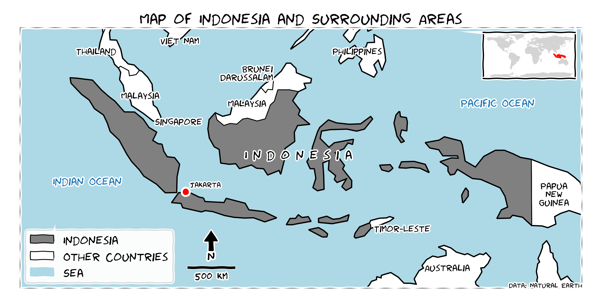

# FLOOD-STREaM

FLOOD-STREaM, an educational tool for near real-time monitoring for floods triggered by extreme rainfall.  

FLOOD-STREaM is one of the output from my MSc reserach project, which has expected outcomes include improved Extreme Rainfall-Triggering Flood (ERTF) monitoring, enhanced flood monitoring capabilities, and new scalable tools and methodologies for disaster risk management. These outcomes will ensure that the methodologies and tools developed can be applied in various geographic regions and adapted for different climatic conditions, contributing to more effective and widespread flood preparedness and response.

This research focuses on remote sensing analysis and satellite-based data to generate flood maps for extreme rainfall events in Indonesia. The analysis is based on IMERG data with a `0.1° x 0.1°` resolution, which may not accurately capture local events. The study excludes complex hydrological issues and focuses solely on grid-based data.

These advancements contribute to a more efficient and scalable flood monitoring and early warning approach. Key innovations of this research include:

1. Utilizing gridded near real-time data for flood alerts.
2. Leveraging free public data for scalable methodology.
3. Providing simple, interpretable outputs for policymakers.
4. Implementing the tool on a geospatial cloud computing platform.

This research hypothesizes that satellite-based extreme rainfall data can effectively trigger large-scale flood analysis and improve early warning systems, significantly enhancing disaster preparedness and response.

With its complex topography and susceptibility to extreme rainfall and flooding, Indonesia serves as the study area. The country's diverse climatic conditions and geographical challenges make it an ideal case for testing the proposed methodologies.

-----

## Disclaimer

The data, climate derivative product and code available in this repository may produce results containing geographic information with limitations due to the scale, resolution, date and interpretation of the original source materials. No liability concerning the content or the use thereof is assumed by the producer.  

## Help

This documentation is created and maintained by Benny Istanto. You can help us improve this guide by simply sending your feedback or by contributing directly to it via [Github](http://github.com/bennyistanto/msc-project).  

For further information about this documentation, please contact:  

**Benny Istanto** 
https://benny.istan.to 
